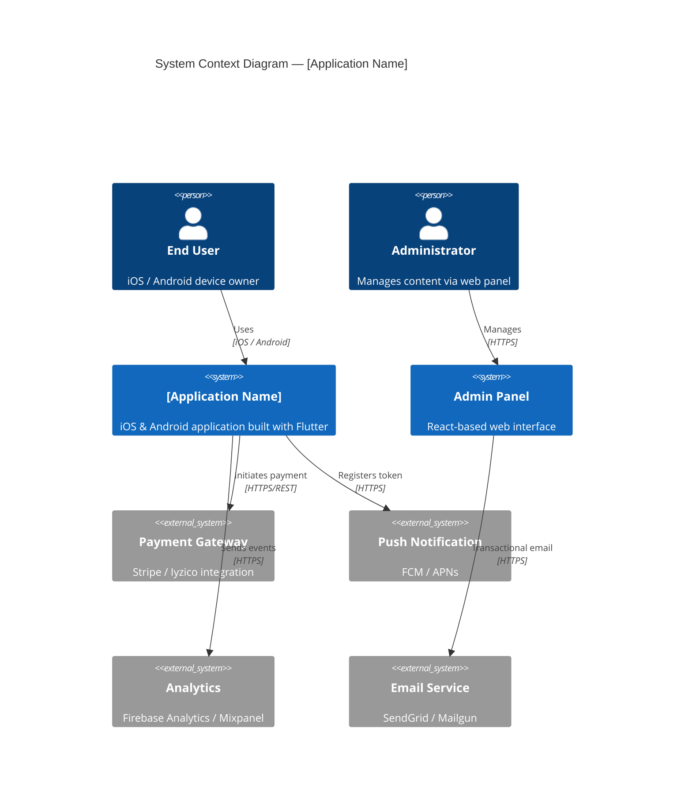

# C4 Mobile — Architecture Diagrams for Mobile Applications

> C4 model methodology with ready-to-use Mermaid templates for documenting
> Flutter apps and their backend services at multiple levels of abstraction.

---

## C4 Levels — Which One to Use and When

Level 1, the Context diagram, answers the question "What does this application do and who uses it?" It is appropriate for all stakeholders, including non-technical ones. Level 2, the Container diagram, answers "What applications and services does it consist of?" It is aimed at the technical team and new members. Level 3, the Component diagram, answers "What is inside a particular container?" It is written for developers and should only be produced for genuinely complex modules. Level 4, the Deployment diagram, answers "Where does it run?" It is intended for DevOps and infrastructure decisions.

As a practical rule, Context and Container diagrams are sufficient for most projects. Component diagrams should only be drawn for internal structures that are actually complex.

---

## Level 1 — System Context Template



---

## Level 2 — Container Diagram Template

```mermaid
C4Container
  title Container Diagram — [Application Name]

  Person(endUser, "End User")
  Person(admin, "Administrator")

  Container_Boundary(mobile, "Mobile Application") {
    Container(flutterApp, "Flutter App", "Flutter 3.x / Dart",
              "User interface, state management, offline cache")
    ContainerDb(localDb, "Local Storage", "Hive / SQLite",
                "Offline data, user preferences")
  }

  Container_Boundary(backend, "Backend Services") {
    Container(apiGateway,  "API Gateway",         "Nginx / Kong",
              "Rate limiting, auth proxy, SSL termination")
    Container(appServer,   "Application Server",  "Node.js / Python / Go",
              "Business logic, REST or GraphQL API")
    Container(notifService,"Notification Service","Node.js",
              "FCM/APNs integration, scheduling")
    ContainerDb(mainDb,    "Primary Database",    "PostgreSQL",
                "Users, content, transaction data")
    ContainerDb(cacheDb,   "Cache",               "Redis",
                "Sessions, frequently accessed data")
  }

  Container_Boundary(admin_panel, "Administration") {
    Container(webApp, "Web Panel", "React", "Content and user management")
  }

  Rel(endUser,     flutterApp,   "Interacts with")
  Rel(flutterApp,  localDb,      "Reads / writes",    "Hive API")
  Rel(flutterApp,  apiGateway,   "API calls",         "HTTPS/REST")
  Rel(apiGateway,  appServer,    "Routes to",         "HTTP")
  Rel(appServer,   mainDb,       "Reads / writes",    "SQL")
  Rel(appServer,   cacheDb,      "Cache operations",  "Redis protocol")
  Rel(appServer,   notifService, "Triggers notification","Internal HTTP")
  Rel(admin,       webApp,       "Uses",              "HTTPS")
  Rel(webApp,      apiGateway,   "API calls",         "HTTPS/REST")

  System_Ext(pushService, "FCM / APNs")
  Rel(notifService, pushService, "Sends push", "HTTPS")
```

---

## Level 3 — Component Diagram (Inside Flutter App)

This level is only drawn for modules that are genuinely complex.

```mermaid
C4Component
  title Component Diagram — Flutter App (Auth Feature)

  Container_Boundary(flutterApp, "Flutter App") {

    Container_Boundary(authFeature, "Auth Feature") {
      Component(loginScreen,  "LoginScreen",       "StatelessWidget",
                "Sign-in UI")
      Component(authBloc,     "AuthBloc",          "Bloc/Cubit",
                "Auth state management")
      Component(loginUseCase, "LoginUseCase",      "Use Case",
                "Sign-in business logic, validation")
      Component(authRepo,     "AuthRepository",    "Repository Impl",
                "Coordinates remote and local data sources")
    }

    Container_Boundary(core, "Core") {
      Component(apiClient,     "ApiClient",            "Dio",
                "HTTP client, interceptors")
      Component(secureStorage, "SecureStorageService", "FlutterSecureStorage",
                "Encrypted token storage")
    }
  }

  Container_Ext(apiGateway, "API Gateway", "Backend")

  Rel(loginScreen,  authBloc,     "Sends events / observes state")
  Rel(authBloc,     loginUseCase, "Calls")
  Rel(loginUseCase, authRepo,     "Calls")
  Rel(authRepo,     apiClient,    "HTTP request")
  Rel(authRepo,     secureStorage,"Reads / writes token")
  Rel(apiClient,    apiGateway,   "HTTPS/REST")
```

---

## Level 4 — Deployment Diagram

```mermaid
C4Deployment
  title Deployment Diagram — Production

  Deployment_Node(userDevice, "User Device", "iOS 15+ / Android 10+") {
    Container(flutterApp, "Flutter App", "Flutter 3.x",
              "Installed from the app store")
  }

  Deployment_Node(cloud, "Cloud Infrastructure", "AWS / GCP") {

    Deployment_Node(cdn, "CDN", "CloudFront") {
      Container(staticAssets, "Static Assets", "S3 + CloudFront",
                "Images, fonts")
    }

    Deployment_Node(appCluster, "Application Cluster", "ECS Fargate / GKE") {
      Container(apiGateway, "API Gateway",    "Nginx",
                "Load balancer, SSL")
      Container(appServer,  "App Server ×2", "Docker Container",
                "Horizontally scalable")
      Container(notifWorker,"Notification Worker","Docker Container",
                "Async queue processor")
    }

    Deployment_Node(dataLayer, "Data Layer") {
      ContainerDb(postgres, "PostgreSQL", "RDS / Cloud SQL",
                  "Primary + Read Replica")
      ContainerDb(redis,    "Redis",      "ElastiCache",
                  "Session cache")
    }
  }

  Deployment_Node(thirdParty, "Third-Party Services") {
    Container(fcm,     "FCM / APNs",       "Google / Apple Push")
    Container(payment, "Payment Provider", "Stripe / Iyzico")
  }

  Rel(flutterApp,  apiGateway,   "HTTPS/REST")
  Rel(flutterApp,  staticAssets, "CDN assets")
  Rel(apiGateway,  appServer,    "HTTP internal")
  Rel(appServer,   postgres,     "SQL")
  Rel(appServer,   redis,        "Cache")
  Rel(notifWorker, fcm,          "Push HTTPS")
  Rel(appServer,   payment,      "Payment API")
```

---

## Style and Writing Conventions

Every element should have a short label (one to three words), a technology note, and a single-sentence description. Relationship labels follow a verb-plus-protocol format: "Reads / writes — SQL" or "Sends events — Dart API."

Boundary blocks (`System_Boundary`, `Container_Boundary`) are used only for groups that represent a real deployment or ownership boundary, never for visual grouping alone.

Abstraction levels must not be mixed within a single diagram. Component-level detail must not appear in a Container diagram.

External systems that are not owned by your team are denoted with the `_Ext` suffix, for example `System_Ext(fcm, "FCM", "Google push notification service")`. This distinction is important: it communicates that the internal structure of these systems is outside your control.

---

## File Organisation

```
docs/
└── architecture/
    ├── c4-context.md              → Level 1, all stakeholders
    ├── c4-containers.md           → Level 2, technical team
    ├── c4-components-auth.md      → Level 3, Auth feature (if needed)
    ├── c4-components-payment.md   → Level 3, Payment feature (if needed)
    └── c4-deployment.md           → Level 4, DevOps
```
