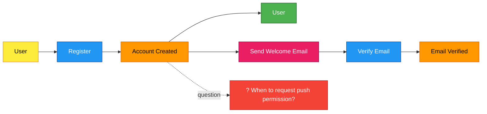
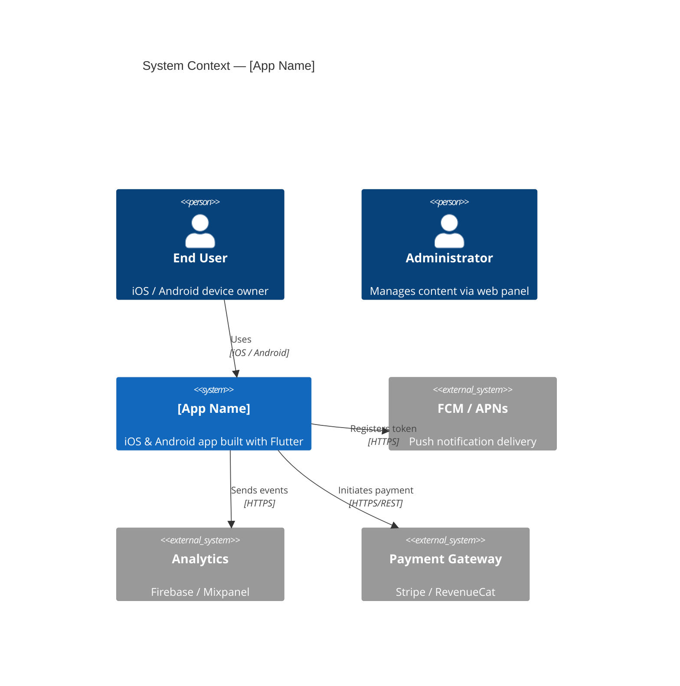
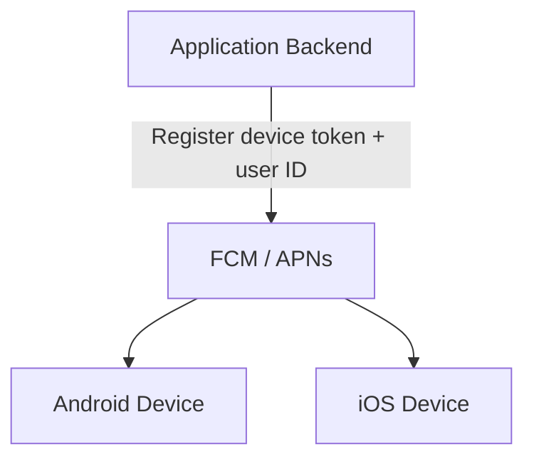

# Mobile System Design

> Architecture + EventStorming + ADR + Mermaid Diagrams — structuring and
> documenting architectural decisions for mobile applications and their backend services.

---

## When to Use This Skill

Invoke this skill in the following situations:

- Before designing a new feature or service
- At an architectural decision point (which approach and why)
- When defining an offline-first, push notification, or sync strategy
- When establishing an API contract between the backend and the mobile client
- When formalising a technical debt or refactoring decision in writing
- When producing architecture documentation for the team or stakeholders

**Core principle:** Complexity is not introduced until it is proven necessary. The simplest working solution is always the first candidate.

---

## The Iron Laws of System Design Documentation

### Law 1: ASK QUESTIONS — No Assumptions

Never make "industry-standard assumptions" without asking first.

| Question                                 | Affected Decision Area                        |
| ---------------------------------------- | --------------------------------------------- |
| Platform: iOS / Android / both?          | Offline strategy, push architecture           |
| Backend: existing API or greenfield?     | Contract design, versioning                   |
| Estimated user count (first six months)? | Scaling decisions                             |
| Is real-time data required?              | WebSocket vs polling vs SSE                   |
| Is offline use a requirement?            | Sync, conflict resolution                     |
| Team size?                               | Mono-repo vs multi-repo, ownership boundaries |

### Law 2: MERMAID ONLY — No ASCII Diagrams

All diagrams MUST use Mermaid format. No exceptions.

- ❌ ASCII art diagrams
- ❌ Text-based flowcharts
- ✅ Mermaid flowcharts, ER diagrams, sequence diagrams, state charts

### Law 3: EVENTSTORMING — Event-Driven Domain Discovery

Use EventStorming methodology for domain analysis. Required before designing large features.

### Law 4: DESIGN LEVEL — No Implementation Details

Stay at the design abstraction level. No SQL schemas, Docker configs, or code snippets in architecture documents.

---

## Architectural Decision Process (4 Steps)

### Step 1 — Distinguish Requirements

**Functional:** What the application must do.
`"Users must be able to save notification preferences."`

**Non-functional:** How it must do it.
`"Preferences must be readable while offline"` / `"Sync must complete under 3 seconds"`

**Constraints:** What cannot be done.
`"User data must not leave the country (data residency)"`

### Step 2 — Evaluate Alternatives

Compare at least two options for every significant decision:

```
Decision: "Offline data synchronisation strategy"

Option A — Last-Write-Wins (LWW)
  Pros:  Simple, no conflicts
  Cons:  Risk of data loss; user changes can be silently overwritten
  When:  Single authoritative source exists

Option B — Operation-Based CRDT
  Pros:  Conflict-free merging, ideal for offline-first
  Cons:  Complex implementation, larger payload
  When:  Collaborative editing, note-taking applications

Option C — Server-Authoritative Sync
  Pros:  Guaranteed consistency, straightforward to debug
  Cons:  Network dependency, latency
  When:  Financial data, security-critical operations

→ Decision: Option C + optimistic UI (immediate user feedback)
```

### Step 3 — Write an ADR

### Step 4 — Review Outcomes

Every ADR is revisited 4–8 weeks later to assess whether results met expectations.

---

## ADR Template

```markdown
# ADR-[number]: [Decision Title]

**Date:** YYYY-MM-DD
**Status:** Draft | Accepted | Rejected | Superseded by ADR-XX
**Decision Maker:** [Name / Team]

## Context

[The technical or business situation that makes this decision necessary.
Assumptions and constraints are stated here.]

## Decision

[What will be done, stated definitively.
"We have decided to use X because..."]

## Alternatives Considered

| Option | Pros | Cons |
| ------ | ---- | ---- |
| A      |      |      |
| B      |      |      |

## Consequences

Positive:

- [Expected benefit 1]

Negative / Accepted Trade-offs:

- [Accepted trade-off]

## Validation Criterion

[How will we know in 8 weeks that this decision was correct?]
```

---

## EventStorming for Domain Discovery

EventStorming is used to understand a domain before designing a large feature. It is accessible to the entire team, not only to architects.

### Colour Code (Mermaid Implementation)

| Colour | Element      | Description                                           |
| ------ | ------------ | ----------------------------------------------------- |
| Orange | Domain Event | Something that happened in the past, cannot be undone |
| Blue   | Command      | The action that triggered an event                    |
| Yellow | Actor        | The user or system that issued the command            |
| Green  | Aggregate    | The business object that holds state                  |
| Pink   | Policy       | The rule that connects an event to a command          |
| Red    | Hotspot      | Area of uncertainty or open questions                 |

### Example: App Onboarding Flow



---

## C4 Diagram Templates (Mermaid)

C4 diagrams communicate architecture at four levels. Choose the level appropriate to your audience.

### Level 1 — System Context (All Stakeholders)



### Level 2 — Container (Technical Team)

```mermaid
C4Container
  title Container Diagram — [App Name]

  Person(user, "End User")

  Container_Boundary(mobile, "Mobile Application") {
    Container(flutterApp, "Flutter App", "Flutter 3.x / Dart",
              "UI, state management, offline cache")
    ContainerDb(localDb, "Local Storage", "Hive / SQLite",
                "Offline data, user preferences")
  }

  Container_Boundary(backend, "Backend Services") {
    Container(apiGateway, "API Gateway", "Nginx",
              "Rate limiting, auth proxy, SSL termination")
    Container(appServer, "Application Server", "Node.js / Go",
              "Business logic, REST or GraphQL API")
    ContainerDb(mainDb, "Primary Database", "PostgreSQL",
                "Users, content, transaction data")
    ContainerDb(cacheDb, "Cache", "Redis",
                "Sessions, frequently accessed data")
  }

  Rel(user, flutterApp, "Interacts with")
  Rel(flutterApp, localDb, "Reads / writes", "Hive API")
  Rel(flutterApp, apiGateway, "API calls", "HTTPS/REST")
  Rel(apiGateway, appServer, "Routes to", "HTTP")
  Rel(appServer, mainDb, "Reads / writes", "SQL")
  Rel(appServer, cacheDb, "Cache operations", "Redis protocol")
```

### File Organisation for Architecture Docs

```
docs/architecture/
├── c4-context.md       → Level 1, all stakeholders
├── c4-containers.md    → Level 2, technical team
├── c4-components-auth.md  → Level 3, only for complex modules
├── c4-deployment.md    → Level 4, DevOps
└── adr/
    ├── ADR-001-state-management.md
    ├── ADR-002-offline-strategy.md
    └── ADR-003-api-versioning.md
```

---

## Mobile Architecture Patterns

### Offline-First Strategy Selection

| App Type                    | Recommended Strategy                 |
| --------------------------- | ------------------------------------ |
| Content reading             | Cache-first (Stale-While-Revalidate) |
| Social / messaging          | Optimistic UI + event queue          |
| Financial / payment         | Online-only (security > UX)          |
| Productivity (notes, tasks) | CRDT or operation log                |
| E-commerce shopping cart    | Local cart, sync on checkout         |

### API Versioning Strategy

Mobile apps cannot be updated instantly — App Store review takes time. Rules:

- Support old clients for **minimum 6 months**
- Adding new response fields is **not** a breaking change
- Deleting or renaming fields **is** breaking
- Use URL versioning (`/v1/`, `/v2/`) or header versioning
- Signal deprecation with `Deprecation` and `Sunset` response headers

### Push Notification Architecture



**Mobile-side rules:**

- Re-send device token to backend on every session start
- Handle foreground, background, and terminated states
- Parse deep link payload and navigate to correct screen
- Keep user notification preferences in sync

### Feature Flag Infrastructure

```dart
class FeatureFlagService {
  FeatureFlagService(this._remoteConfig);
  final RemoteConfig _remoteConfig;

  // Default values always defined — works without network
  static const _defaults = {
    'new_checkout_flow':  false,
    'ai_recommendations': false,
    'dark_mode_v2':       true,
  };

  bool isEnabled(String flag) => _remoteConfig.getBool(flag);

  Future<void> initialize() async {
    await _remoteConfig.setDefaults(_defaults);
    await _remoteConfig.fetchAndActivate();
  }
}
```

---

## System Design Validation Checklist

**Simplicity**

- [ ] Was a simpler alternative considered?
- [ ] Does the chosen complexity address a current requirement?

**Data**

- [ ] Has the offline scenario been defined?
- [ ] Is there a conflict resolution strategy?
- [ ] Is personal data handled per privacy regulations?

**API and Integration**

- [ ] Has an API versioning strategy been determined?
- [ ] How long will old client support be maintained?
- [ ] Are timeout, retry, and circuit-breaker behaviours defined?

**ADR**

- [ ] Has the decision been written down?
- [ ] Are rejected alternatives and their rationale documented?
- [ ] Has a validation criterion been specified?

**Diagrams**

- [ ] Are all diagrams in Mermaid format?
- [ ] Is the diagram level appropriate for the audience?
- [ ] Are external systems marked with `_Ext` suffix?
- [ ] No implementation details in design artifacts?
