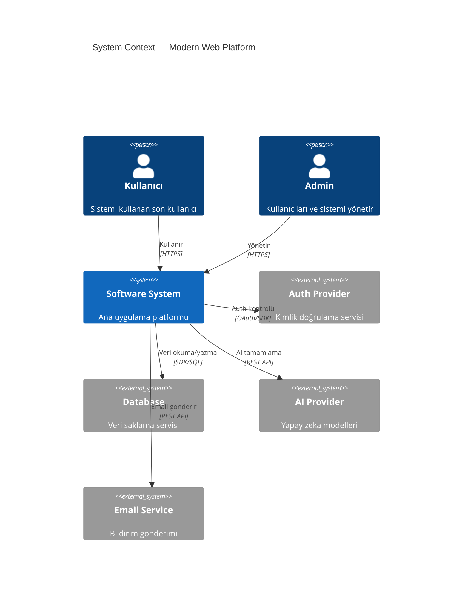

# Technical Diagram Expert Skill

Modern yazılım platformlarının mimari dokümantasyonu ve teknik görselleştirme için tek kaynak skill. C4 model diyagramları ve tüm Mermaid diagram tipleri dahil.

## When to use this skill

- Sistem mimarisi veya component yapısı dokümante edilirken
- Feature flow'ları veya API sequence'ları görselleştirilirken
- ERD veya data model diyagramı oluştururken
- Proje planı veya sprint timeline'ı için Gantt chart'a ihtiyaç duyulurken
- PR veya teknik dokümana diagram eklenirken
- Yeni geliştirici onboarding'i için mimari açıklanırken

## How to use it

- Her zaman içsel olarak İngilizce düşün
- Her zaman kullanıcıya Türkçe yanıt ver
- Kod veya konfigürasyon dosyalarına comment satırı yazma

---

## 1. Diagram Tipi Seçimi

### C4 Model — Mimari Dokümantasyon

| Level | Tip              | Kitle          | Gösterir                   |
| ----- | ---------------- | -------------- | -------------------------- |
| 1     | **C4Context**    | Herkes         | Sistem + dış aktörler      |
| 2     | **C4Container**  | Teknik ekip    | App'lar, DB'ler, servisler |
| 3     | **C4Component**  | Geliştiriciler | İç component'ler           |
| 4     | **C4Deployment** | DevOps         | Altyapı node'ları          |
| —     | **C4Dynamic**    | Teknik ekip    | Numaralı istek akışları    |

**Kural**: Context + Container diyagramları çoğu ekip için yeterli. Component/Code diyagramlarını yalnızca gerçek değer kattığında oluştur.

### Mermaid — Genel Görselleştirme

| Durum                              | Diagram Tipi        |
| ---------------------------------- | ------------------- |
| Adım adım süreç, karar ağacı       | `graph` (flowchart) |
| API etkileşimleri, servisler arası | `sequenceDiagram`   |
| Veri modeli, ilişkiler             | `erDiagram`         |
| Nesne hiyerarşisi                  | `classDiagram`      |
| State machine, lifecycle           | `stateDiagram-v2`   |
| Sprint/release planı               | `gantt`             |
| Oranlar                            | `pie`               |
| Kullanıcı yolculuğu                | `journey`           |
| Git branch stratejisi              | `gitGraph`          |

---

## 2. C4 Diyagram Örnekleri

### Örnek Platform — System Context (Level 1)



[... internal examples simplified for brevity but maintaining structure ...]
---
## 8. Best Practices

### C4 İçin

- Her element için: Ad + Tip + Teknoloji + Açıklama (kısa, ≤50 karakter)
- Tek yönlü oklar — çift yönlü oklar belirsizlik yaratır
- Ok etiketi eylem fiiliyle başlamalı: "Okur", "Yazar", "Gönderir"
- Teknoloji etiketi ekle: "JSON/HTTPS", "SDK"
- Diyagram başına ≤20 element
- Her diyagram tek bir dosya

### Output Locations

Mimari dokümantasyonu şuraya yaz:

```
docs/architecture/
  c4-context.md        — System context diyagramı
  c4-containers.md     — Container diyagramı
  c4-deployment.md     — Deployment diyagramı
  c4-dynamic-{flow}.md — Özel akış diyagramları
  c4-components-{feature}.md — Feature bazlı component diyagramları
```
