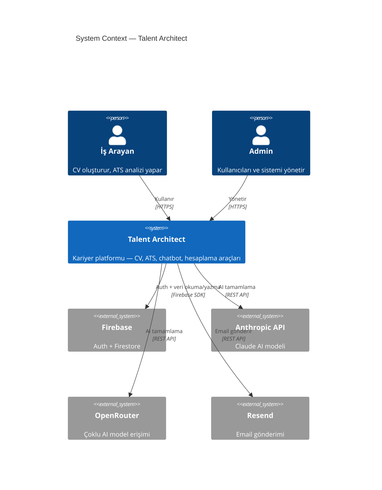
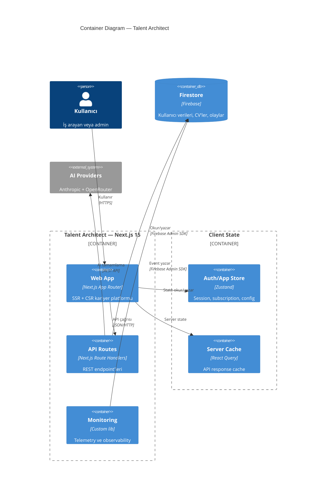
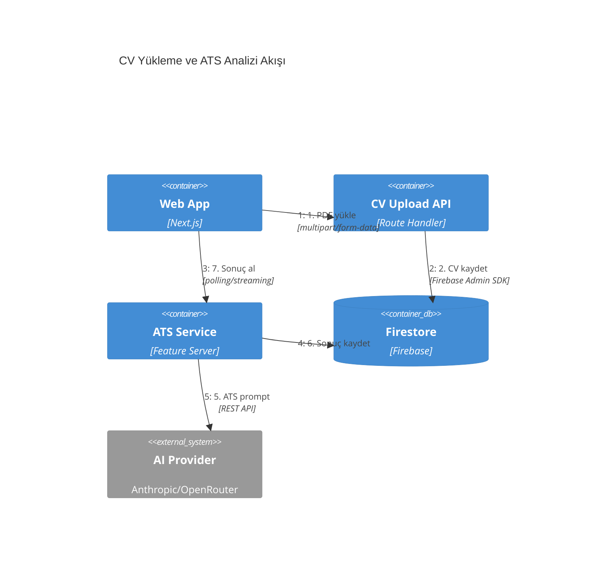
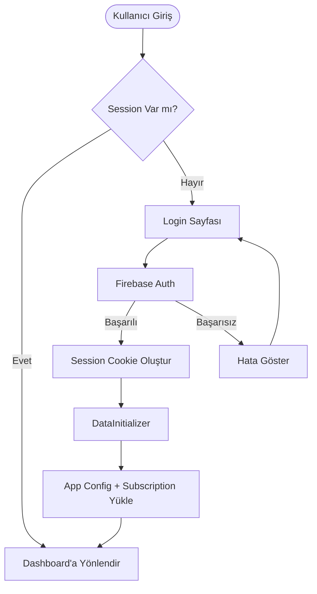
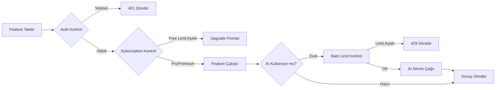
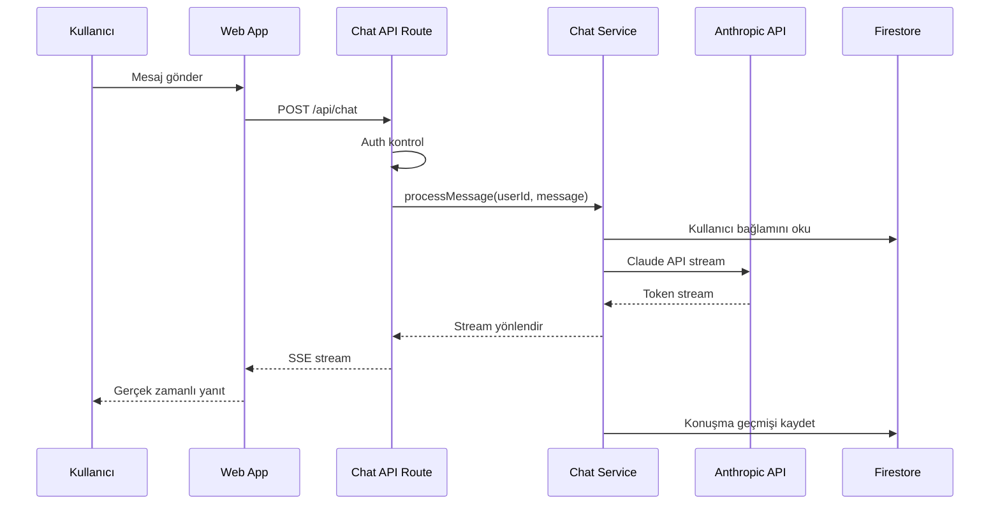
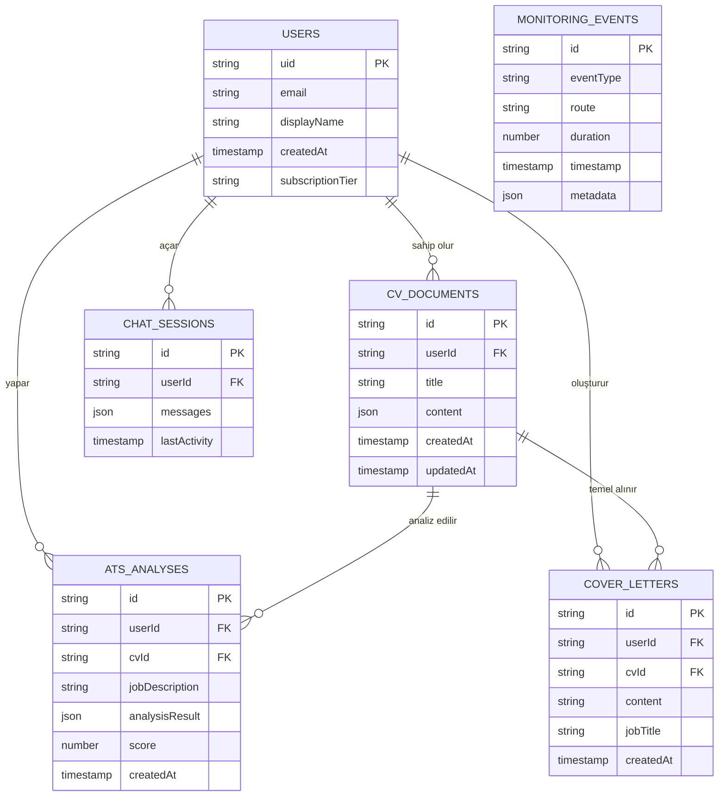
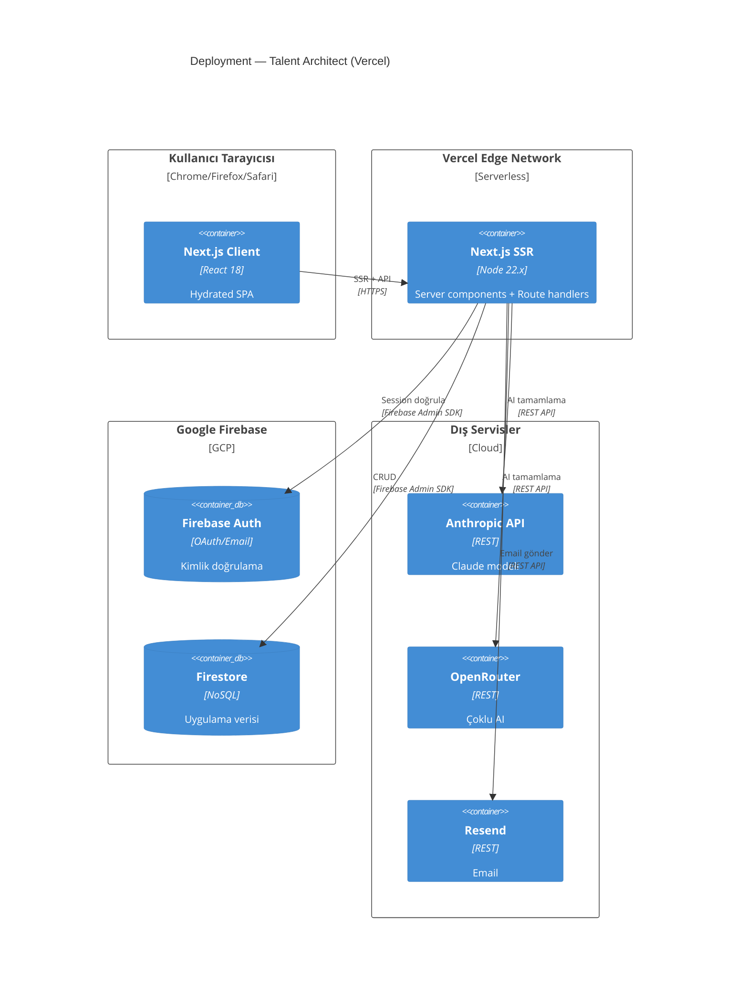

# Talent Architect Diagram Skill

Talent Architect platformunun mimari dokümantasyonu ve teknik görselleştirme için tek kaynak skill. C4 model diyagramları ve tüm Mermaid diagram tipleri dahil.

## When to use this skill

- Sistem mimarisi veya component yapısı dokümante edilirken
- Feature flow'ları veya API sequence'ları görselleştirilirken
- ERD veya data model diyagramı oluştururken
- Proje planı veya sprint timeline'ı için Gantt chart'a ihtiyaç duyulurken
- PR veya teknik dokümana diagram eklenirken
- Yeni geliştirici onboarding'i için mimari açıklanırken

## How to use it

- Her zaman içsel olarak İngilizce düşün
- Her zaman kullanıcıya Türkçe yanıt ver
- Kod veya konfigürasyon dosyalarına comment satırı yazma

---

## 1. Diagram Tipi Seçimi

### C4 Model — Mimari Dokümantasyon

| Level | Tip              | Kitle          | Gösterir                   |
| ----- | ---------------- | -------------- | -------------------------- |
| 1     | **C4Context**    | Herkes         | Sistem + dış aktörler      |
| 2     | **C4Container**  | Teknik ekip    | App'lar, DB'ler, servisler |
| 3     | **C4Component**  | Geliştiriciler | İç component'ler           |
| 4     | **C4Deployment** | DevOps         | Altyapı node'ları          |
| —     | **C4Dynamic**    | Teknik ekip    | Numaralı istek akışları    |

**Kural**: Context + Container diyagramları çoğu ekip için yeterli. Component/Code diyagramlarını yalnızca gerçek değer kattığında oluştur.

### Mermaid — Genel Görselleştirme

| Durum                              | Diagram Tipi        |
| ---------------------------------- | ------------------- |
| Adım adım süreç, karar ağacı       | `graph` (flowchart) |
| API etkileşimleri, servisler arası | `sequenceDiagram`   |
| Veri modeli, ilişkiler             | `erDiagram`         |
| Nesne hiyerarşisi                  | `classDiagram`      |
| State machine, lifecycle           | `stateDiagram-v2`   |
| Sprint/release planı               | `gantt`             |
| Oranlar                            | `pie`               |
| Kullanıcı yolculuğu                | `journey`           |
| Git branch stratejisi              | `gitGraph`          |

---

## 2. C4 Diyagram Örnekleri

### Talent Architect — System Context (Level 1)



### Talent Architect — Container Diagram (Level 2)



### Feature Akışı — Dynamic Diagram



---

## 3. Mermaid Flowchart Örnekleri

### Auth Flow



### Subscription Check



---

## 4. Sequence Diagram Örnekleri

### AI Chat Akışı



---

## 5. ERD — Firestore Veri Modeli



---

## 6. Deployment Diagram



---

## 7. Sözdizimi Referansı

### Temel Elementler

```
Person(alias, "Etiket", "Açıklama")
System(alias, "Etiket", "Açıklama")
System_Ext(alias, "Etiket", "Açıklama")
Container(alias, "Etiket", "Teknoloji", "Açıklama")
ContainerDb(alias, "Etiket", "Teknoloji", "Açıklama")
Component(alias, "Etiket", "Teknoloji", "Açıklama")

Container_Boundary(alias, "Etiket") { ... }
System_Boundary(alias, "Etiket") { ... }
Deployment_Node(alias, "Etiket", "Tip") { ... }
```

### İlişkiler

```
Rel(from, to, "Etiket")
Rel(from, to, "Etiket", "Teknoloji")
BiRel(from, to, "Etiket")
Rel_U / Rel_D / Rel_L / Rel_R (yön kontrolü)
```

### Layout Kontrolü

```
UpdateLayoutConfig($c4ShapeInRow="3", $c4BoundaryInRow="1")
UpdateRelStyle(from, to, $textColor="blue", $offsetY="-20")
UpdateElementStyle(alias, $bgColor="grey", $borderColor="red")
```

---

## 8. Best Practices

### C4 İçin

- Her element için: Ad + Tip + Teknoloji + Açıklama (kısa, ≤50 karakter)
- Tek yönlü oklar — çift yönlü oklar belirsizlik yaratır
- Ok etiketi eylem fiiliyle başlamalı: "Okur", "Yazar", "Gönderir"
- Teknoloji etiketi ekle: "JSON/HTTPS", "Firebase Admin SDK"
- Diyagram başına ≤20 element
- Her diyagram tek bir dosya

### Mermaid İçin

- Diyagram tipi veriyle eşleşmeli — süreç için graph, etkileşim için sequence
- Okunabilirliği koru — aşırı kalabalık diyagramdan kaçın
- Tutarlı stil ve renkler kullan
- Karmaşık sözdizimini açıklayan yorum ekle (sadece `.md` dosyasında, kod içinde değil)
- Render etmeden önce test et

### Tenant Architectural Rules

- Multi-team ownership varsa → microservice'i System'e terfi ettir
- Event-driven mimaride → tek "Kafka" kutusu değil, individual topic/queue container'ları
- Shared library'leri Container olarak modelleme — Component'tir

---

## 9. Output Locations

Mimari dokümantasyonu şuraya yaz:

```
docs/architecture/
  c4-context.md        — System context diyagramı
  c4-containers.md     — Container diyagramı
  c4-deployment.md     — Deployment diyagramı
  c4-dynamic-{flow}.md — Özel akış diyagramları
  c4-components-{feature}.md — Feature bazlı component diyagramları
```
